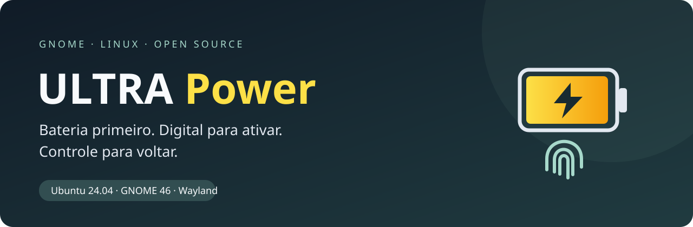
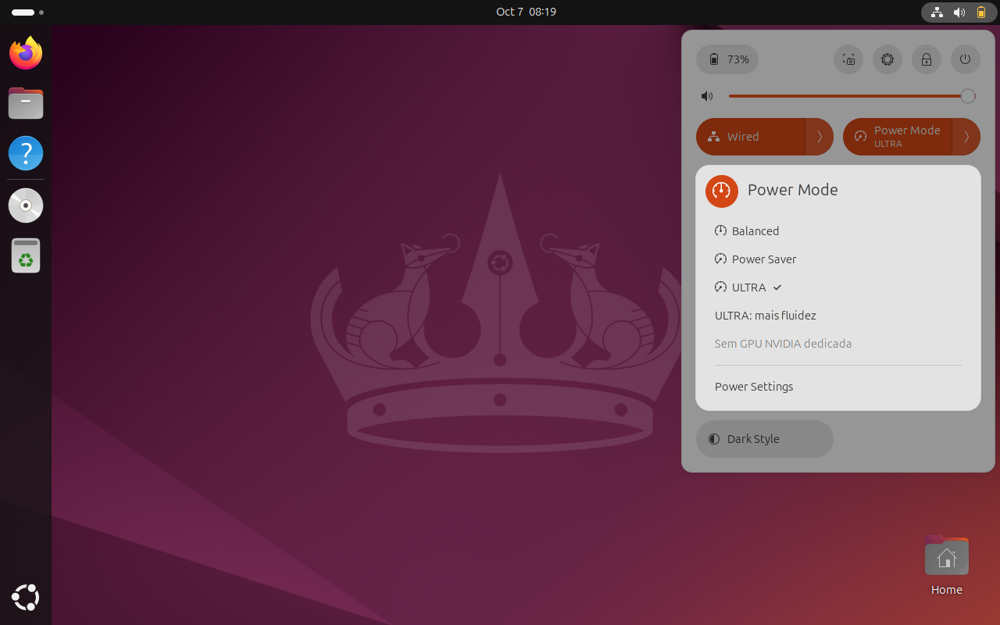

<p align="center"></p>

<p align="center">
<a href="https://github.com/vcanonici/gnome-ultra-power/actions/workflows/ci.yml"></a>
<a href="https://github.com/vcanonici/gnome-ultra-power/releases/latest"></a>
<a href="LICENSE"></a>

</p>

Um modo de economia dedicado a **Brave, terminal e tarefas leves**. Escolha **ULTRA** no menu de energia do GNOME, aprove com uma nova leitura da digital e veja o ícone da bateria ficar amarelo. Volte aos perfis normais a qualquer momento.

A ideia é aceitar um computador menos potente para reduzir o consumo. O ganho depende da bateria, do firmware e da carga real; esta versão não promete uma quantidade de horas.

**[Baixar v1.0.0](https://github.com/vcanonici/gnome-ultra-power/releases/tag/v1.0.0)** · **[Recuperação](docs/RECOVERY.md)** · **[Como funciona](docs/ARCHITECTURE.md)** · **[English quick start](docs/README.en.md)**

<p align="center"></p>
<p align="center"><em>Captura real da VM de validação; bateria e leitor simulados.</em></p>

## O que muda

| Recurso | Com ULTRA ativo |
| --- | --- |
| CPU | Sessão limitada a até dois núcleos físicos; turbo desativado e preferência de economia quando o driver disponibiliza os controles |
| Mais fluidez | Opção no mesmo menu amplia a afinidade para até seis núcleos físicos |
| Tela | Brilho reduzido a até 20%, quando o controle existe; nunca aumenta um brilho já menor |
| Teclado | Retroiluminação no nível 1, quando existe e é suportado |
| NVIDIA | Solicita runtime PM e informa **suspensa**, **ativa** ou **desconhecida**; GPU ativa significa economia parcial |
| Bluetooth | Desliga somente adaptadores sem periféricos conectados no momento da ativação |
| Processos | Pausa indexador Tracker e GNOME Remote Desktop do usuário, se ativos |
| Rede e navegador | Mantém Wi-Fi, VPNs, firewall e abas abertas; não altera flags nem o perfil do Brave |
| Carregador | Ao conectar, sai do ULTRA e seleciona desempenho, ou equilibrado se desempenho não existir; ao desconectar, usa economia |

A afinidade afeta toda a sessão desse usuário, incluindo GNOME e aplicações. Compilação, vídeo pesado, jogos e muitas abas terão menos desempenho. O servidor remoto do usuário fica indisponível durante ULTRA; o Remote Login global não é parado.

Por padrão, **CPUs continuam online** e **containers/VMs continuam rodando**. As opções adicionais estão abaixo.

## Compatibilidade da v1

| Ambiente | Estado |
| --- | --- |
| Ubuntu 24.04 · GNOME 46 · Wayland · x86_64 | Único ambiente aceito pelo instalador |
| ThinkPad T15p, Intel híbrida + NVIDIA | Referência física do controlador original; digital e GPU suspensa validadas pelo operador |
| Ubuntu 24.04 em QEMU, conta UID 1001 | Pacote público validado com D-Bus/PAM e bateria simulados, sem NVIDIA |
| Outras CPUs Intel / AMD | Topologia detectada; cobertura por testes, sem validação física em todos os modelos |
| GNOME 47–51, KDE, Xorg, outras distribuições | Não suportados nesta release; pré-verificação recusa a instalação |

Precisa de **bateria detectada pelo UPower**, sessão local desbloqueada e **leitor compatível com fprintd com digital cadastrada**. Se a sua máquina não tem leitor, a v1 não poderá ativar ULTRA.

TLP, tuned, auto-cpufreq e o controlador piloto ThinkPad não podem estar ativos junto deste coordenador. O instalador recusa o conflito; escolha conscientemente qual gerenciamento manter.

## Instalação

Na sessão do usuário que utilizará ULTRA, confirme os requisitos. Se faltarem dependências no Ubuntu suportado:

```bash
sudo apt install python3-dbus python3-gi fprintd libpam-fprintd power-profiles-daemon
fprintd-enroll
```

`fprintd-enroll` cadastra uma digital pelo serviço existente. Faça isso sem sudo. O instalador adiciona apenas o serviço PAM próprio `ultra-power`; não modifica o PAM do login gráfico ou do sudo.

Baixe **o pacote completo** e os checksums da release:

```bash
curl -fLO https://github.com/vcanonici/gnome-ultra-power/releases/download/v1.0.0/gnome-ultra-power-1.0.0.tar.gz
curl -fLO https://github.com/vcanonici/gnome-ultra-power/releases/download/v1.0.0/SHA256SUMS
sha256sum --check --ignore-missing SHA256SUMS
tar -xzf gnome-ultra-power-1.0.0.tar.gz
cd gnome-ultra-power-1.0.0
sudo /usr/bin/python3 scripts/install.py doctor --user "$USER"
sudo /usr/bin/python3 scripts/install.py install --user "$USER"
```

Interrompa se a verificação do checksum falhar. `doctor` faz leitura e não instala arquivos. O instalador não substitui uma instalação existente e preserva a lista de outras extensões.

**Salve o trabalho, saia da sessão e entre novamente** para o GNOME carregar a extensão. A instalação não encerra a sessão automaticamente.

O ZIP da extensão é um componente separado para inspeção/desenvolvimento: sozinho não instala o serviço privilegiado. Use o `.tar.gz` para instalação completa.

## Usar

1. Desconecte o carregador e abra o menu de energia nas Configurações Rápidas.
2. Escolha **ULTRA**. A janela explica os compromissos antes da leitura da digital.
3. Coloque o dedo cadastrado no leitor. Cada ativação exige uma nova aprovação.
4. O ícone amarelo confirma ULTRA ativo. O menu informa se a NVIDIA permanece acordada.
5. Escolha **ULTRA: mais fluidez** se precisar, ou selecione um perfil normal para sair.

Aplicações que usam NVIDIA são apresentadas antes da ativação. Você pode continuar com economia parcial ou autorizar explicitamente o encerramento forçado dos processos elegíveis. Encerramento forçado pode perder trabalho não salvo. GNOME, Xwayland, processos de outro usuário e serviços protegidos não são encerrados.

```bash
ultra-power             # estado JSON
ultra-power responsive  # mais fluidez, enquanto ativo
ultra-power off         # sair e recuperar ajustes
```

Não há comando de ativação que dispense a digital. O modo não persiste após reinício; a regra dos perfis ao conectar/desconectar o carregador permanece enquanto o serviço estiver instalado.

## Opções para quem aceita mais restrições

Escolha na primeira instalação; a v1 não oferece atualização sobre arquivos existentes:

```bash
sudo /usr/bin/python3 scripts/install.py install --user "$USER" --offline-cpus
sudo /usr/bin/python3 scripts/install.py install --user "$USER" --pause-containers
# É possível combinar as duas opções numa única instalação.
```

`--offline-cpus` permite desligar CPUs não selecionadas globalmente, preservando CPU0. Isso afeta também outros usuários e workloads do sistema; nem todo firmware/driver suporta a transição. O padrão usa somente afinidade da sessão.

`--pause-containers` permite parar Docker e seus containers, suspender VMs libvirt e pausar Docker Desktop durante ULTRA. Há impacto em bancos de dados, serviços e trabalho remoto. Só serviços previamente ativos são retomados na saída.

## NVIDIA e tela integrada

ULTRA **não troca drivers, BIOS, PRIME, regras de boot ou servidor gráfico**. Se a tela ou uma saída externa depende da NVIDIA, essa GPU poderá continuar ativa. O modo continua com economia parcial e exibe a limitação.

Usar a integrada como renderizador e remover cargas CUDA/saídas externas ligadas à dedicada pode permitir runtime suspend, dependendo do hardware. Veja [diagnóstico e limites](docs/ARCHITECTURE.md#gpu). Não aplique regras PCI ou números de CPUs de outra máquina.

## Remover e atualizar

Use o instalador da versão que você instalou:

```bash
sudo /usr/bin/python3 scripts/install.py remove
```

A remoção interrompe o serviço, restaura os ajustes pendentes, remove apenas os arquivos ULTRA e seu UUID da lista de extensões, e restaura o perfil de energia anterior à instalação. O manifesto privado é arquivado em `/var/lib/ultra-power-install-removed-*`. Saia/entre na sessão para descarregar completamente a interface.

Se houver recuperação pendente, a remoção é interrompida e o manifesto permanece. Veja [RECOVERY.md](docs/RECOVERY.md). Para atualizar, primeiro remova a versão anterior, confira o resultado e instale a nova.

## Desenvolvimento e evidências

```bash
sudo apt install python3-dbus python3-gi python3-venv
python3 -m venv --system-site-packages .venv
.venv/bin/pip install mypy==1.18.2
PATH="$PWD/.venv/bin:$PATH" bash scripts/check.sh
python3 scripts/build-release.py
```

Node é necessário apenas para a verificação de sintaxe da extensão. O runtime usa Python tipado, GJS, D-Bus, systemd e PAM. CI verifica testes, tipos estritos, sintaxe e empacotamento; não substitui testes reais do leitor ou do firmware. Consulte [validação da release](docs/VALIDATION.md), [CONTRIBUTING.md](CONTRIBUTING.md) e [SECURITY.md](SECURITY.md).

Licença [GPL-3.0-or-later](LICENSE). Projeto independente, sem vínculo com GNOME, Ubuntu, Lenovo, NVIDIA ou Brave.
