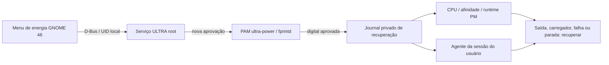

# Arquitetura e escopo

A extensão usa a integração de energia do GNOME 46. Essas APIs incluem objetos internos do Shell; por isso a versão é limitada e extensões que modificam o mesmo menu podem conflitar. [Documentação do GNOME](https://gjs.guide/extensions/development/creating.html).

O serviço aceita somente a conta configurada, sessão local em seat0, Wayland, desbloqueada e na bateria. root pode pedir recuperação, mas não ativar. A digital passa por um serviço PAM separado com três tentativas e timeout. Uma desconexão do cliente ou bloqueio da sessão cancela uma aprovação pendente.

Configuração e recuperação têm validação de tipos e listas restritas de caminhos/serviços. O journal é gravado atomicamente, com fsync e modo 0600 num diretório 0700, antes das mudanças. Ajustes transitórios de cgroup e máscaras de serviços usam `--runtime`. Reiniciar não reativa ULTRA.

## CPU

O instalador lê CPUs online, pacote/núcleo físico e frequência máxima. Prefere núcleos com menor frequência máxima e menos irmãos SMT; essa é uma heurística de topologia, não uma medição de eficiência. Nunca usa os IDs particulares do ThinkPad de origem. Máquinas de um só núcleo têm fallback.

O padrão restringe a sessão por `AllowedCPUs` sem desligar CPUs do sistema. O hotplug é opcional. EPP é aplicado enquanto a política cpufreq está ativa, antes do hotplug; políticas inativas são ignoradas. Isso evita o `EBUSY` observado no hardware de referência.

Controles de turbo, EPP, brilho e retroiluminação são opcionais. Um erro de escrita real provoca rollback; a ausência de um controle não é tratada como se ele tivesse sido aplicado. [CPUFreq no kernel Linux](https://docs.kernel.org/admin-guide/pm/cpufreq.html).

## GPU

A descoberta usa vendor/class PCI e aceita múltiplas GPUs NVIDIA. O status depende de runtime PM em sysfs, sem executar `nvidia-smi` repetidamente. Sem NVIDIA, o estado é `not-present`; não há aviso falso de GPU desconhecida.

FDs abertos em `/dev/nvidia*` não comprovam atividade elétrica. GNOME/Xwayland podem manter referências passivas quando o renderizador primário identificado nos logs é integrado Intel/AMD. Processos elegíveis apresentados para encerramento recebem identidade PID/starttime/UID e são revalidados antes de qualquer sinal, usando pidfd. Servidor gráfico, root, outro usuário e serviços protegidos permanecem protegidos.

A versão pública não modifica drivers nem aplica a regra Intel específica do piloto. Uma GPU que alimenta a tela pode permanecer ativa; a interface informa economia parcial. Não há promessa de desligamento elétrico em todas as máquinas.

## Instalação

`doctor` recusa versões sem suporte, ausência de bateria/digital e coordenadores concorrentes. O instalador não sobrescreve destinos existentes, preserva outras extensões e registra hashes dos arquivos PAM de login/sudo para verificar que permaneceram intactos.

O serviço root fica em `/usr/local/lib/ultra-power`; a extensão pertence ao usuário em `~/.local/share/gnome-shell/extensions/ultra-power@vcanonici`. O manifesto fica em `/var/lib/ultra-power-install`, com acesso root. D-Bus: `io.github.vcanonici.UltraPower`; unidade: `ultra-power.service`.

Instale somente código que você tenha revisado e considere confiável: o controlador recebe privilégios de root para gerenciar energia. A distribuição não inclui senhas, chaves, dados biométricos, configurações de VPN, serial de hardware nem histórico do repositório de manutenção.
